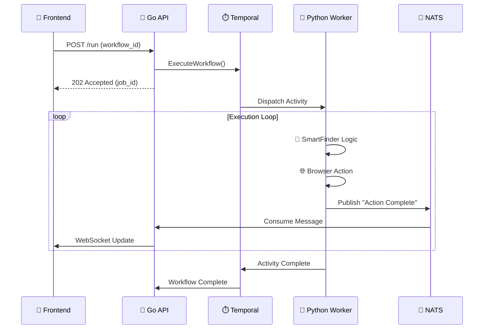

# 🌊 System Flow Architecture

### _Tracing the Data Journey from Click to Execution_

This document explains exactly how data moves through the e2e-Platform, ensuring reliability, real-time feedback, and semantic execution.

---

## 🔄 The Lifecycle of a Job

The flow consists of **4 Main Stages**:

1.  **Ingestion (The Trigger)**
2.  **Orchestration (The Manager)**
3.  **Execution (The Worker)**
4.  **Feedback (The Nervous System)**

---

### 1. Ingestion (Go Control Plane)

_The entry point for all requests._

1.  **User Request**: The Frontend sends a `POST /run` request with a `workflow_id` (e.g., "linkedin_scraper") and `params`.
2.  **Validation**: The Go server validates the payload and checks **Redis Rate Limits**.
3.  **Job Creation**: A unique `job_id` is generated (e.g., `job-1733812345`).
4.  **Temporal Trigger**: The Go server uses the Temporal SDK to **Start a Workflow Execution**.
5.  **Response**: The server immediately responds with `202 Accepted` and the `job_id`, releasing the HTTP connection.

> **Why this matters**: The API is _non-blocking_. It doesn't wait for the scrape to finish. It just says "I've queued it."

---

### 2. Orchestration (Temporal)

_The brain that ensures nothing is ever lost._

1.  **Workflow Queue**: Temporal puts the job into the `e2e-browser-tasks` queue.
2.  **State Persistence**: Temporal records "Workflow Started" in its Postgres database.
3.  **Assignment**: Temporal looks for an available **Python Worker** that is polling the queue.
4.  **Retries**: If the Python worker crashes mid-job, Temporal **automatically retries** the step on a different worker, preserving the history.

---

### 3. Execution (Python Worker)

_Where the actual work happens._

1.  **Activity Start**: The Python worker picks up the task.
2.  **Glass Box Initialization**:
    - Launches a **Playwright** browser instance (Chromium).
    - Injects the **Network Sniffer** to capture traffic.
    - Initializes the **SmartFinder** (AI Engine).
3.  **Recipe Execution**:
    - The worker loads the "Recipe" (steps to follow) from **Qdrant** or local cache.
    - It executes steps one by one: `Navigate`, `Find Element`, `Click`, `Extract`.
4.  **Semantic Resolution**:
    - When a step says "Click the login button", **SmartFinder** scans the page.
    - It calculates scores (Lexical + Semantic) to find the best match.
    - It interacts with the element.

---

### 4. Feedback (The Nervous System)

_Real-time updates to the user._

1.  **Event Emission**:
    - Every time the Python worker does something (e.g., "Found button", "Navigating..."), it publishes a message to **NATS JetStream**.
    - Subject: `job.update.<job_id>`
2.  **Go Consumer**:
    - The Go Control Plane has a background listener subscribed to `job.update.*`.
    - It receives the message from NATS.
3.  **WebSocket Broadcast**:
    - The Go server finds the active WebSocket connection for that `job_id`.
    - It pushes the JSON event to the Frontend.
4.  **User UI**:
    - The user sees a log line appear instantly: _"✅ Found 'login button' (Score: 0.98)"_.

---

## 🧩 Visual Data Flow

