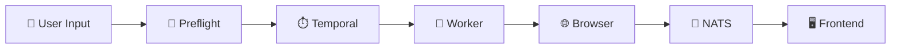
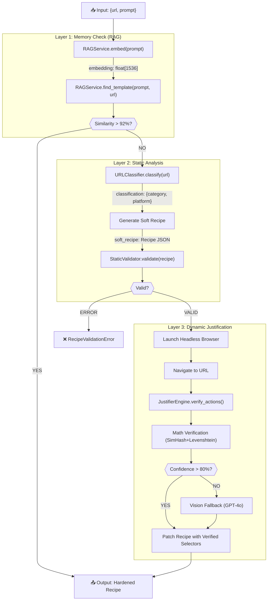
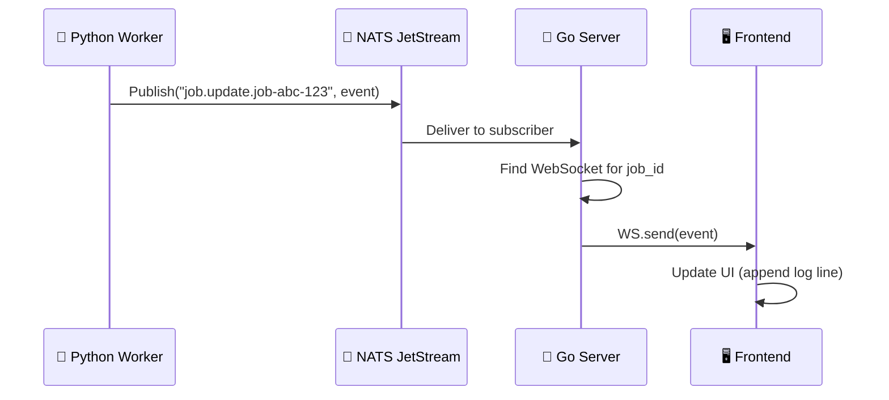
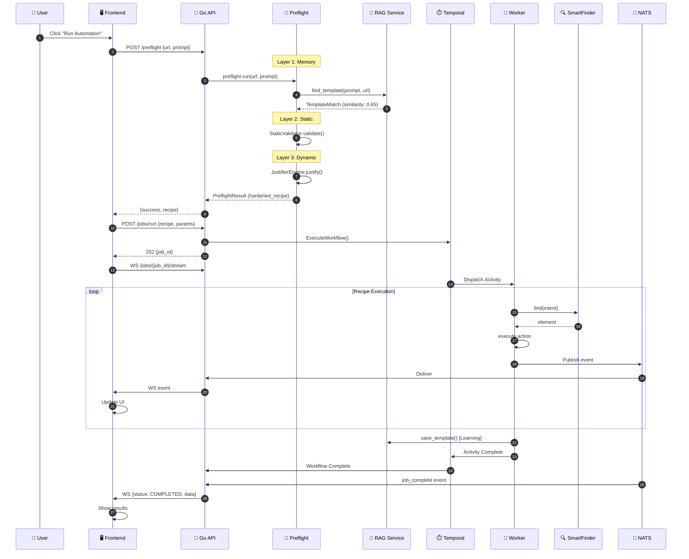

# 🌊 System Flow Architecture - Complete Data Journey

### _From User Input → Preflight → Execution → Frontend Output_

This document traces **every function call, input, and output** through the Quanta automation platform.

---

## 📋 Table of Contents

1. [High-Level Overview](#high-level-overview)
2. [Stage 1: User Input](#stage-1-user-input)
3. [Stage 2: Preflight Pipeline](#stage-2-preflight-pipeline)
4. [Stage 3: Job Orchestration](#stage-3-job-orchestration)
5. [Stage 4: Recipe Execution](#stage-4-recipe-execution)
6. [Stage 5: Frontend Updates](#stage-5-frontend-updates)
7. [Complete Sequence Diagram](#complete-sequence-diagram)

---

## High-Level Overview



---

## Stage 1: User Input

### 1.1 Frontend Request

**User Action:** Clicks "Run Automation" button in the frontend.

```typescript
// Frontend sends:
POST /api/engine/preflight
{
    "url": "https://linkedin.com/login",
    "prompt": "Login with my credentials and scrape my profile"
}
```

| Field    | Type   | Description                       |
| -------- | ------ | --------------------------------- |
| `url`    | string | Target website URL                |
| `prompt` | string | Natural language task description |

---

## Stage 2: Preflight Pipeline



### 2.1 Layer 1: Memory Check

**Function:** `RAGService.find_template(prompt, url)`

```python
# INPUT
prompt = "Login with my credentials and scrape my profile"
url = "https://linkedin.com/login"

# INTERNAL CALLS
embedding = await RAGService.embed(f"{prompt} {url}")
# Output: float[1536] vector

# QUERY
SELECT recipe_json,
       1 - (embedding <=> query_embedding) AS similarity
FROM recipe_templates
WHERE domain = 'linkedin.com'
ORDER BY embedding <=> query_embedding
LIMIT 3

# OUTPUT
TemplateMatch(
    id="abc-123",
    category="social",
    domain="linkedin.com",
    task_type="login",
    recipe_json={...},
    similarity=0.94  # If > 0.92, return immediately
)
```

| If                   | Then                                    |
| -------------------- | --------------------------------------- |
| `similarity >= 0.92` | **Fast Path**: Return verified template |
| `similarity < 0.92`  | Continue to Layer 2                     |

---

### 2.2 Layer 1.5: URL Classification

**Function:** `URLClassifier.classify(url)`

```python
# INPUT
url = "https://linkedin.com/login"

# FAST PATH (Known Domains)
KNOWN_DOMAINS = {"linkedin.com": ("social", "LinkedIn", "High")}

# OR AI PATH (Unknown Domains)
GPT-4o-mini prompt: "Classify this website..."

# OUTPUT
ClassificationResult(
    category="social",
    platform="LinkedIn",
    complexity="High",
    confidence=0.95,
    features={
        "auth_required": True,
        "captcha_likely": False,
        "has_anti_bot": True
    }
)
```

---

### 2.3 Layer 2: Static Validation

**Function:** `StaticValidator.validate(recipe)`

```python
# INPUT
soft_recipe = {
    "version": "2.0.0",
    "nodes": [...],
    "edges": [...],
    "entry_point": "node_login"
}

# CHECKS PERFORMED (No Browser)
1. Schema Compliance     → Pydantic validation
2. Variable Integrity    → All {{ vars }} defined?
3. Graph Topology        → Valid DAG? Orphan nodes?
4. Loop Safety          → max_iterations present?
5. Reachability         → All nodes reachable from entry?
6. Timeout Coverage     → timeout_ms on all nodes?

# OUTPUT
ValidationResult(
    is_valid=True,
    errors=[],
    warnings=[
        ValidationIssue(code="W001", message="Variable may not be defined")
    ]
)
```

| If                 | Then                          |
| ------------------ | ----------------------------- |
| `is_valid = False` | Raise `RecipeValidationError` |
| `is_valid = True`  | Continue to Layer 3           |

---

### 2.4 Layer 3: Dynamic Justification

**Function:** `JustifierEngine.justify_recipe(recipe, url)`

```python
# INPUT
recipe = { validated soft recipe }
url = "https://linkedin.com/login"

# STEP 1: Launch Browser (Stealth Mode)
browser = playwright.chromium.launch(headless=True)
await page.goto(url)

# STEP 2: For each action in recipe
for action in recipe.nodes[*].actions:
    if action.type in ("find_and_click", "find_and_type"):

        # ATTEMPT 1: Math Verification
        result = await verify_with_math(action.intent)
        # Uses: SimHash fingerprinting + Levenshtein distance
        # Output: (selector, confidence)

        if result.confidence >= 0.80:
            action._verified_selector = result.selector
            action._verification_status = "verified"
        else:
            # ATTEMPT 2: Vision Fallback (Expensive!)
            screenshot = await page.screenshot()
            vision_result = GPT-4o-Vision(screenshot, intent)
            # Output: {"x": 123, "y": 456}

            if vision_result.found:
                action._verified_selector = get_selector_at_point(x, y)
                action._verification_status = "vision_verified"
            else:
                action._verification_status = "calibration_needed"

# OUTPUT
JustificationResult(
    success=True,
    patched_recipe={...},  # With _verified_selector on each action
    verifications=[
        ElementVerification(intent="login button", status="verified", confidence=0.92)
    ],
    duration_ms=2450
)
```

---

### 2.5 Preflight Final Output

**Function:** `PreflightPipeline.run()` returns `PreflightResult`

```python
# FINAL OUTPUT TO FRONTEND
{
    "success": true,
    "recipe": {
        "version": "2.0.0",
        "metadata": {"name": "LinkedIn Login"},
        "nodes": [
            {
                "id": "node_login",
                "actions": [
                    {
                        "type": "find_and_click",
                        "intent": "login button",
                        "_verified_selector": "#login-btn",
                        "_verification_status": "verified"
                    }
                ]
            }
        ]
    },
    "source": "patched",
    "meta": {
        "memory_hit": false,
        "memory_similarity": 0.65,
        "static_valid": true,
        "justification_success": true,
        "calibration_needed": false,
        "timing": {
            "total_ms": 3200,
            "memory_ms": 120,
            "generation_ms": 500,
            "static_ms": 15,
            "justification_ms": 2565
        }
    }
}
```

---

## Stage 3: Job Orchestration

### 3.1 Go Control Plane Creates Job

**Endpoint:** `POST /api/jobs/run`

```go
// INPUT (From Frontend)
{
    "recipe": { hardened_recipe_from_preflight },
    "params": {
        "username": "user@email.com",
        "password": "encrypted_password"
    }
}

// INTERNAL
job_id = uuid.New()  // "job-abc-123-456"

// Temporal SDK Call
client.ExecuteWorkflow(
    context,
    workflowOptions{TaskQueue: "e2e-browser-tasks"},
    "BrowserWorkflow",
    job_id,
    recipe,
    params
)

// OUTPUT (Immediate Response)
{
    "job_id": "job-abc-123-456",
    "status": "QUEUED",
    "message": "Job queued for execution"
}
// HTTP 202 Accepted
```

---

### 3.2 Temporal Workflow Dispatch

```python
# Temporal Server Actions
1. Persist workflow state to PostgreSQL
2. Place job in "e2e-browser-tasks" queue
3. Wait for available Python Worker
4. Dispatch Activity to Worker
```

---

## Stage 4: Recipe Execution

### 4.1 Python Worker Picks Up Job

**Activity:** `execute_recipe_activity`

```python
# INPUT (From Temporal)
job_id = "job-abc-123-456"
recipe = { hardened_recipe }
params = { "username": "...", "password": "..." }

# STEP 1: Initialize Execution Context
ctx = ExecutionContext(
    job_id=job_id,
    inputs=params,
    context_vars=recipe.context.initial
)

# STEP 2: Launch Browser
browser = await playwright.chromium.launch()
ctx.browser = browser
ctx.page = await browser.new_page()
```

---

### 4.2 RecipeEngine Execution Loop

**Function:** `RecipeEngine.run()`

```python
# For each node in recipe (starting from entry_point)
current_node = recipe.entry_point

while current_node:
    node = recipe.get_node(current_node)

    # STEP 1: Check Pre-Conditions
    await StepGuard.check_pre_conditions(node)

    # STEP 2: Execute Node
    if node.type == "action":
        for action in node.actions:
            await ActionNodeProcessor.execute(action)

            # EMIT EVENT TO NATS
            await NervousSystem.emit({
                "job_id": job_id,
                "event": "action_complete",
                "node_id": node.id,
                "action_type": action.type,
                "status": "success"
            })

    elif node.type == "loop":
        await LoopNodeProcessor.execute(node)

    elif node.type == "decision":
        next_branch = await DecisionNodeProcessor.evaluate(node)

    # STEP 3: Check Post-Conditions
    await StepGuard.check_post_conditions(node)

    # STEP 4: Save Checkpoint (if configured)
    if node.state_policy.checkpoint:
        await StateManager.save_checkpoint(node.id, ctx)

    # STEP 5: Determine Next Node
    current_node = get_next_node(node, edges)
```

---

### 4.3 SmartFinder Element Resolution

**Function:** `SmartFinder.find(intent, metadata)`

```python
# INPUT
intent = "login button"
metadata = { existing_simhash: "abc123" }

# LAYER 1: REFLEX (SimHash) - <10ms
if metadata.simhash exists:
    element = find_by_simhash(metadata.simhash)
    if element: return FindResult(element, layer=REFLEX, confidence=0.99)

# LAYER 2: HEURISTIC (Levenshtein) - ~50ms
candidates = page.query_selector_all("button, a, [role='button']")
for candidate in candidates:
    score = levenshtein_ratio(intent, candidate.text)
    if score > 0.85:
        return FindResult(candidate, layer=HEURISTIC, confidence=score)

# LAYER 3: SEMANTIC (Vector DB) - ~200ms
result = QdrantVectorDB.search(intent)
if result: return FindResult(locate(result.selector), layer=SEMANTIC)

# LAYER 4: COGNITIVE (LLM) - ~2000ms
selector = LLMAgent.recover(intent, page.content())
if selector: return FindResult(page.query_selector(selector), layer=COGNITIVE)

# OUTPUT
FindResult(
    element=<ElementHandle>,
    layer=FinderLayer.HEURISTIC,
    confidence=0.92,
    duration_ms=45
)
```

---

### 4.4 Job Completion

```python
# On Success
result = {
    "job_id": job_id,
    "status": "COMPLETED",
    "data": extracted_data,
    "duration_ms": 45000
}

# LEARNING HOOK: Save successful recipe to RAG
await RAGService.save_template(
    recipe_json=recipe,
    category="social",
    domain="linkedin.com",
    task_type="login"
)

# Return to Temporal
return result
```

---

## Stage 5: Frontend Updates

### 5.1 Event Flow: Worker → NATS → Go → WebSocket → Frontend



### 5.2 Event Types Sent to Frontend

| Event             | When                 | Payload                                  |
| ----------------- | -------------------- | ---------------------------------------- |
| `job_started`     | Job begins           | `{job_id, timestamp}`                    |
| `node_started`    | Each node begins     | `{job_id, node_id, node_name}`           |
| `action_complete` | Each action finishes | `{job_id, node_id, action_type, status}` |
| `element_found`   | SmartFinder succeeds | `{job_id, intent, layer, confidence}`    |
| `screenshot`      | On error/checkpoint  | `{job_id, image_base64}`                 |
| `job_complete`    | Job finishes         | `{job_id, status, data, duration_ms}`    |

---

### 5.3 Frontend WebSocket Handler

```typescript
// Frontend receives real-time updates
socket.onmessage = (event) => {
  const data = JSON.parse(event.data);

  switch (data.event) {
    case "job_started":
      addLogLine("🚀 Job started...");
      break;
    case "action_complete":
      addLogLine(`✅ ${data.action_type} completed`);
      break;
    case "element_found":
      addLogLine(`🔍 Found "${data.intent}" (${data.confidence}%)`);
      break;
    case "job_complete":
      if (data.status === "COMPLETED") {
        showSuccess(data.data);
        // Update TanStack Query cache
        queryClient.invalidateQueries(["jobs"]);
      } else {
        showError(data.error);
      }
      break;
  }
};
```

---

### 5.4 Final Frontend Display

```typescript
// Job Result Component
<JobResult>
    <Status>✅ COMPLETED</Status>
    <Duration>45.2 seconds</Duration>
    <Logs>
        [10:00:01] 🚀 Job started
        [10:00:02] 📄 Navigated to linkedin.com/login
        [10:00:04] 🔍 Found "email input" (Layer 2, 94%)
        [10:00:05] ⌨️ Typed username
        [10:00:07] 🔍 Found "password input" (Layer 1, 99%)
        [10:00:08] ⌨️ Typed password
        [10:00:10] 🔍 Found "login button" (Layer 2, 91%)
        [10:00:11] 🖱️ Clicked login button
        [10:00:15] ✅ Login successful
        [10:00:45] 📊 Data extracted
        [10:00:46] ✅ Job completed
    </Logs>
    <ExtractedData>{profile data...}</ExtractedData>
</JobResult>
```

---

## Complete Sequence Diagram



---

## Summary: Complete Data Flow

| Step | Component       | Input             | Output                 | Next        |
| ---- | --------------- | ----------------- | ---------------------- | ----------- |
| 1    | Frontend        | User click        | `{url, prompt}`        | API         |
| 2    | Preflight       | `{url, prompt}`   | `PreflightResult`      | API         |
| 3    | RAG             | `prompt + url`    | `TemplateMatch`        | Preflight   |
| 4    | Classifier      | `url`             | `{category, platform}` | Preflight   |
| 5    | StaticValidator | `recipe`          | `ValidationResult`     | Preflight   |
| 6    | Justifier       | `recipe, url`     | `JustificationResult`  | Preflight   |
| 7    | Go API          | `recipe, params`  | `job_id`               | Temporal    |
| 8    | Temporal        | `job_id, recipe`  | Activity dispatch      | Worker      |
| 9    | Worker          | `job_id, recipe`  | Execute actions        | SmartFinder |
| 10   | SmartFinder     | `intent`          | `element`              | Worker      |
| 11   | Worker          | Action result     | NATS event             | NATS        |
| 12   | NATS            | Event             | Delivery               | Go API      |
| 13   | Go API          | Event             | WebSocket push         | Frontend    |
| 14   | Frontend        | WS event          | UI update              | User        |
| 15   | RAG             | Successful recipe | Saved template         | Memory      |
