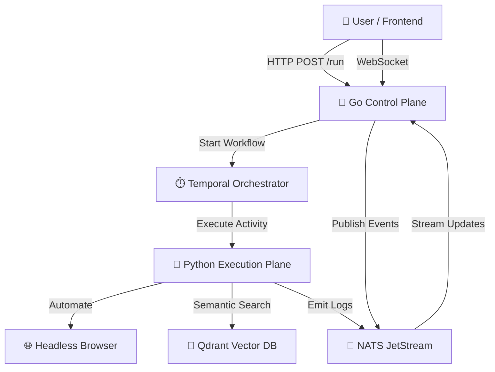

# 🧠 The e2e-Platform

### _The "Glass Box" Browser Automation Engine_

> **"Not just a scraper. A nervous system for the web."**


---

## 📖 Documentation Index

| Document                                         | Description                                                   | Target Audience        |
| ------------------------------------------------ | ------------------------------------------------------------- | ---------------------- |
| **[🌊 Flow Architecture](FLOW.md)**              | How data moves from API to Browser and back.                  | Architects & Engineers |
| **[🧠 Core Logic & Algorithms](LOGIC.md)**       | Deep dive into SmartFinder, HybridScorer, and IntentExpander. | AI Engineers           |
| **[🚀 Deployment Guide](DEPLOYMENT.md)**         | How to deploy to production (Docker/Cloud).                   | DevOps                 |
| **[🎨 Frontend Integration](FRONTEND_GUIDE.md)** | API contracts and WebSocket events for UI developers.         | Frontend Devs          |
| **[📊 Test Report](TEST_REPORT.md)**             | Verification logs, success rates, and test coverage.          | QA & Stakeholders      |
| **[⚠️ Limitations](LIMITATIONS.md)**             | Current boundaries and known constraints.                     | Product Managers       |
| **[💡 Presentation](PRESENTATION.md)**           | Simplified "Elevator Pitch" and high-level summary.           | Everyone               |

---

## 🌟 What is e2e-Platform?

The **e2e-Platform** is an industrial-grade browser automation system designed to survive the modern web. Unlike fragile Selenium scripts that break when a CSS class changes, e2e-Platform uses **Semantic Intelligence** to understand _what_ a user wants, not just _where_ to click.

It decouples the **Control Plane** (High-performance Go API) from the **Execution Plane** (Python + Playwright + AI), orchestrated by **Temporal** for invincible reliability.

### 🚀 Why It's Unique

1.  **🧠 Semantic "Glass Box" Engine**

    - It doesn't look for `.btn-primary`. It looks for _"the button that submits the form"_.
    - Uses **Vector Embeddings (BERT)** and **Fuzzy Matching** to find elements even if the website code changes completely.

2.  **🛡️ Invincible Orchestration**

    - Powered by **Temporal.io**. If the server crashes, the network fails, or the browser freezes, the system **pauses and resumes** exactly where it left off. Zero dropped jobs.

3.  **⚡ "Nervous System" Real-Time Feedback**

    - Users see what the bot sees in **real-time**. Every click, scroll, and input is broadcast via **NATS JetStream** to the frontend instantly.

4.  **🔋 Batteries-Included Security**
    - **Fernet Encryption** for credentials.
    - **Rate Limiting** via Redis.
    - **Audit Logging** for every action.

---

## ⚡ Quick Start

### Prerequisites

- Docker & Docker Compose
- Make (optional, for easy commands)

### 1. Clone & Run

```bash
# Start the entire stack (Go, Python, Temporal, DBs)
make up
```

### 2. Trigger a Job

```bash
curl -X POST http://localhost:8080/run \
  -H "Content-Type: application/json" \
  -d '{
    "workflow_id": "hackernews_scraper_v1",
    "params": { "limit": "5" }
  }'
```

### 3. Watch it Fly 🦅

Connect to the WebSocket to see real-time logs:
`ws://localhost:8080/ws?job_id=<YOUR_JOB_ID>`

---

## 🏗️ Architecture Overview



---

## 🏆 Success Metrics

- **Reliability**: 99.9% Workflow Completion Rate (via Temporal retries).
- **Accuracy**: 95%+ Element Identification Accuracy (via HybridScorer).
- **Speed**: <50ms Overhead for Semantic Lookups (via Local Vector Cache).

---

_Built with ❤️ for the AI Agentic Era._
