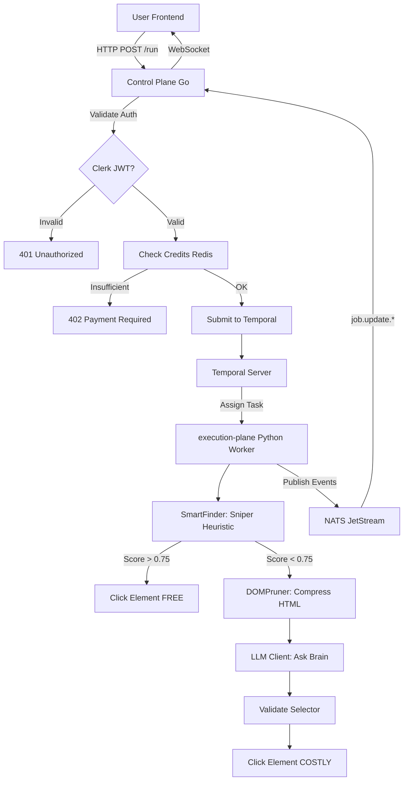
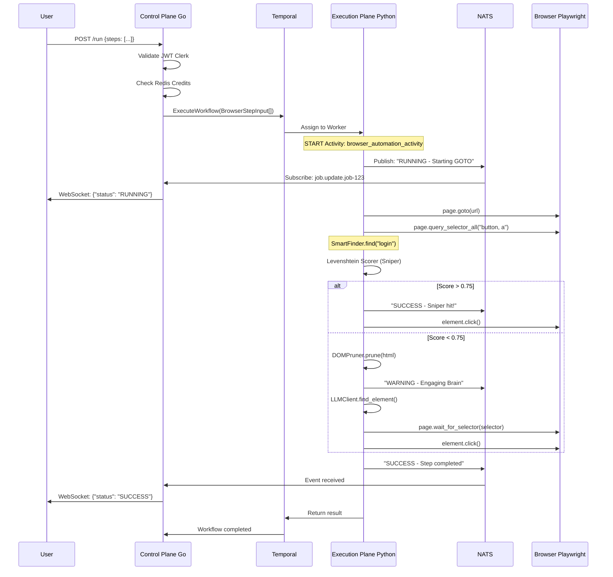

# e2e-Backend Codebase Structure & Flow Documentation

**Version:** 0.2.0-alpha
**Architecture:** Polyglot Microservices (Go Control Plane + Python Execution Plane)
**Last Updated:** December 4, 2025

---

## Table of Contents

1. [Project Overview](#project-overview)
2. [Complete Folder Structure](#complete-folder-structure)
3. [Architecture Flow](#architecture-flow)
4. [Component Details](#component-details)
5. [Data Flow Diagram](#data-flow-diagram)
6. [Key Technologies](#key-technologies)

---

## Project Overview

e2e is an **Intelligent RPA (Robotic Process Automation) Platform** that separates concerns between:
- **Control Plane (Go):** High-throughput I/O handling (HTTP, WebSockets, Auth)
- **Execution Plane (Python):** Heavy compute tasks (Browser automation with Playwright, AI inference)
- **Communication Layer (NATS + Protobuf):** Asynchronous, type-safe messaging

### Core Philosophy
- **"Sniper → Brain" Fallback:** 80% of interactions use free heuristic algorithms (Levenshtein distance), falling back to expensive LLM calls only when necessary
- **Deterministic Algorithms First:** Avoid AI costs through mathematical solutions
- **Event-Driven Architecture:** Real-time feedback via NATS JetStream + WebSockets

---

## Complete Folder Structure

### 📁 Root Directory
```
/e2e-Backend/
├── .env                          # Environment variables (NATS_URL, TEMPORAL_HOST, etc.)
├── .gitignore                    # Git ignore rules
├── Readme.md                     # Main project documentation
├── DEPLOYMENT.md                 # Production deployment guide
├── Makefile                      # Build automation commands
├── docker-compose.yml            # Local infrastructure stack
├── worker.log                    # Execution plane logs
│
├── api/                          # 📍 Protobuf API Contracts (Single Source of Truth)
├── apps/                         # 📍 Application Services
├── config/                       # 📍 Infrastructure Configuration
├── scripts/                      # 📍 Development & Build Scripts
├── infra/                        # Terraform & Kubernetes manifests
└── migrations/                   # Database migration scripts
```

---

### 📁 API Directory (Protobuf Contracts)

**Path:** `/api`

```
api/
├── go.mod                        # Go module for protobuf generation
├── go.sum                        # Go dependency lockfile
│
├── proto/                        # 📍 Source .proto files
│   └── v1/
│       ├── Readme.md             # Protobuf schema documentation
│       ├── workflow.proto        # Core workflow/job definitions
│       └── events.proto          # Event streaming definitions
│
└── gen/                          # 📍 Auto-generated code (DO NOT EDIT MANUALLY)
    ├── go/v1/                    # Generated Go code
    │   ├── events.pb.go          # Event message types
    │   ├── workflow.pb.go        # Workflow message types
    │   └── workflow_grpc.pb.go   # gRPC service stubs
    │
    └── python/v1/                # Generated Python code
        ├── events_pb2.py         # Event message types
        ├── events_pb2_grpc.py    # Event gRPC stubs
        ├── workflow_pb2.py       # Workflow message types
        └── workflow_pb2_grpc.py  # Workflow gRPC stubs
```

**Key Files:**
- [`workflow.proto`](file:///Users/muhammadaliyan/Programming/Artificial%20Intelligence/e2e-Backend/api/proto/v1/workflow.proto) - Defines `BrowserStepInput`, `WorkflowService`, `ExecuteWorkflowRequest/Response`
- [`events.proto`](file:///Users/muhammadaliyan/Programming/Artificial%20Intelligence/e2e-Backend/api/proto/v1/events.proto) - Defines `StepUpdateEvent` for real-time feedback

**Generation Command:**
```bash
make proto
```

---

### 📁 APPS Directory (Microservices)

**Path:** `/apps`

```
apps/
├── control-plane/               # 📍 Go API Gateway
└── execution-plane/             # 📍 Python Worker
```

#### 🔹 Control Plane (Go Service)

**Path:** `/apps/control-plane`

```
control-plane/
├── Dockerfile                   # Container image definitiongo.mod                      # Go module dependencies
├── go.sum                       # Dependency lockfile
├── env.example                  # Environment template
│
├── cmd/
│   └── server/
│       ├── main.go              # 🎯 ENTRY POINT - HTTP/WebSocket server
│       └── health_test.go       # Health check tests
│
├── internal/                    # Private packages (not importable externally)
│   ├── auth/                    # Authentication (Clerk integration)
│   ├── billing/
│   │   ├── ledger_consumer.go   # NATS consumer for billing events
│   │   └── stripe_webhook.go    # Stripe payment webhooks
│   ├── events/
│   │   └── consumer.go          # NATS event consumer (job updates)
│   ├── gateway/                 # API routing logic
│   ├── middleware/
│   │   └── billing.go           # Credit/quota enforcement middleware
│   ├── telemetry/
│   │   └── telemetry.go         # OpenTelemetry instrumentation
│   └── ws/
│       ├── manager.go           # 🎯 WebSocket connection pool
│       └── manager_test.go      # WebSocket tests
│
├── pkg/                         # Public packages (can be imported)
│
└── tests/
    └── Live_Feed.html           # WebSocket client test page
```

**Core Responsibilities:**
1. **HTTP API** - `/run` endpoint to trigger workflows
2. **WebSocket Manager** - Real-time updates to frontend
3. **NATS Consumer** - Listens to `job.update.*` subjects
4. **Temporal Client** - Submits workflows to Temporal
5. **Authentication** - Clerk JWT validation
6. **Billing** - Credit deduction and Stripe webhooks

---

#### 🔹 Execution Plane (Python Service)

**Path:** `/apps/execution-plane`

```
execution-plane/
├── Dockerfile                   # Container image definition
├── requirements.txt             # 🎯 Production dependencies
├── requirements-dev.txt         # Development/testing dependencies
├── pyproject.toml               # Python project metadata
├── env.example                  # Environment template
│
├── src/                         # 📍 Main source code
│   ├── worker.py                # 🎯 ENTRY POINT - Temporal worker
│   ├── workflows.py             # Temporal workflow definitions
│   ├── telemetry.py             # OpenTelemetry setup
│   │
│   ├── activities/
│   │   └── activities.py        # 🎯 browser_automation_activity (core execution)
│   │
│   ├── algorithms/              # 📍 Heuristic Scoring (The "Sniper")
│   │   ├── heuristic.py         # Generic heuristic base class
│   │   └── levenshtein.py       # 🎯 Levenshtein distance scorer
│   │
│   └── core/                    # 📍 Core Business Logic
│       ├── smart_finder.py      # 🎯 Sniper → Brain fallback orchestrator
│       ├── dom_pruner.py        # 🎯 HTML compression (token reduction)
│       ├── llm_client.py        # 🎯 LLM integration (OpenAI/Gemini)
│       ├── nervous_system.py    # 🎯 NATS publisher (feedback loop)
│       └── security.py          # Encryption helpers (AWS KMS)
│
├── tests/
│   ├── test_page.html           # Test HTML page (Sniper validation)
│   ├── test_report.html         # Test results output
│   ├── serve.py                 # Local HTTP server for test_page.html
│   ├── test_llm_client.py       # LLM client unit tests
│   ├── test_logic_core.py       # Core logic tests
│   ├── test_security.py         # Security module tests
│   └── test_smart_finder.py     # SmartFinder integration tests
│
└── venv/                        # Python virtual environment (gitignored)
```

**Core Responsibilities:**
1. **Temporal Worker** - Listens to `e2e-browser-tasks` queue
2. **Browser Automation** - Playwright (Chromium) headless execution
3. **Smart Finder** - Element detection with Sniper → Brain fallback
4. **NATS Publisher** - Publishes `StepUpdateEvent` to `job.update.{job_id}`
5. **LLM Integration** - GPT-4/Gemini API calls for complex element finding
6. **Security** - Credential encryption before storage

---

### 📁 CONFIG Directory

**Path:** `/config`

```
config/
└── nats.conf                    # NATS JetStream configuration
```

**Contents of [`nats.conf`](file:///Users/muhammadaliyan/Programming/Artificial%20Intelligence/e2e-Backend/config/nats.conf):**
- JetStream enabled
- Persistence settings
- Subject patterns for `job.update.*`

---

### 📁 SCRIPTS Directory

**Path:** `/scripts`

```
scripts/
├── gen-proto.sh                 # 🎯 Regenerate Protobuf code (Go + Python)
└── setup-dev.sh                 # Development environment setup
```

**Usage:**
```bash
# Regenerate Protobuf bindings
./scripts/gen-proto.sh

# Setup development environment (install deps, start infra)
./scripts/setup-dev.sh
```

---

## Architecture Flow

### High-Level Request Flow



---

### Detailed Component Interaction



---

## Component Details

### 🎯 Control Plane: `main.go`

**File:** [`apps/control-plane/cmd/server/main.go`](file:///Users/muhammadaliyan/Programming/Artificial%20Intelligence/e2e-Backend/apps/control-plane/cmd/server/main.go)

**Key Functions:**

| Function | Purpose |
|----------|---------|
| `main()` | 1. Connect to NATS<br>2. Connect to Temporal<br>3. Start WebSocket Manager<br>4. Start NATS Consumer<br>5. Start Gin HTTP server |
| `Consumer.StartListening()` | Subscribe to `job.update.*`, unmarshal Protobuf, broadcast to WebSocket |
| `/run` Handler | Convert steps → Temporal workflow, return `job_id` |
| `/ws` Handler | Upgrade HTTP → WebSocket, join job-specific room |
| `/health` Handler | Health check endpoint |

**Environment Variables:**
- `NATS_URL` - Default: `nats://localhost:4222`
- `TEMPORAL_HOST` - Default: `localhost:7233`
- `PORT_GO_API` - Default: `8080`

---

### 🎯 Execution Plane: `worker.py`

**File:** [`apps/execution-plane/src/worker.py`](file:///Users/muhammadaliyan/Programming/Artificial%20Intelligence/e2e-Backend/apps/execution-plane/src/worker.py)

**Key Functions:**

| Function | Purpose |
|----------|---------|
| `main()` | 1. Load `.env`<br>2. Initialize OpenTelemetry<br>3. Connect to Temporal<br>4. Create Worker with task queue |
| `handle_shutdown()` | Graceful shutdown on SIGTERM/SIGINT |
| Worker Registration | Register `BrowserWorkflow` + `browser_automation_activity` |

**Task Queue:** `e2e-browser-tasks`

---

### 🎯 Smart Finder: The Core Algorithm

**File:** [`apps/execution-plane/src/core/smart_finder.py`](file:///Users/muhammadaliyan/Programming/Artificial%20Intelligence/e2e-Backend/apps/execution-plane/src/core/smart_finder.py)

**Algorithm Flow:**

```python
class SmartFinder:
    async def find(page: Page, intent: str) -> ElementHandle:
        # PHASE 1: SNIPER (Free, Fast)
        elements = await page.query_selector_all("button, a, input, [role='button']")
        dom_elements = [extract_text_and_attributes(el) for el in elements]

        best_match = LevenshteinScorer.find_best_candidate(dom_elements, intent)

        if best_match.score > 0.75:
            return best_match.element  # ✅ FREE PATH

        # PHASE 2: BRAIN (Costly, Accurate)
        full_html = await page.content()
        cleaned_html = DOMPruner.prune(full_html)  # Reduce tokens

        result = LLMClient.find_element(cleaned_html, intent)
        selector = result["selector"]

        element = await page.wait_for_selector(selector)
        return element  # ⚠️ COSTLY PATH
```

**Weighted Scoring (Levenshtein):**
```python
base_score = 1 - (levenshtein_distance(intent, element.text) / max_len)
bonus_score = 0

if element.tag == "button": bonus_score += 0.20
if element.attributes.get("id") in intent: bonus_score += 0.30
if element.attributes.get("aria-label") in intent: bonus_score += 0.40

final_score = base_score + bonus_score
```

---

### 🎯 Nervous System: Real-Time Feedback

**File:** [`apps/execution-plane/src/core/nervous_system.py`](file:///Users/muhammadaliyan/Programming/Artificial%20Intelligence/e2e-Backend/apps/execution-plane/src/core/nervous_system.py)

**Key Function:**
```python
class NervousSystem:
    @staticmethod
    async def publish_update(job_id: str, node_id: str, status: str, message: str):
        """
        Publish StepUpdateEvent to NATS JetStream.
        Subject: job.update.{job_id}
        Payload: Protobuf-serialized StepUpdateEvent
        """
        event = StepUpdateEvent(
            job_id=job_id,
            node_id=node_id,
            status=status,
            log_message=message,
            timestamp=int(time.time())
        )

        data = event.SerializeToString()  # Protobuf binary
        await nats_client.publish(f"job.update.{job_id}", data)
```

---

## Data Flow Diagram

### Protobuf Message Types

#### 1. **BrowserStepInput** (Go → Temporal → Python)

```protobuf
message BrowserStepInput {
  string job_id = 1;              // "job-1733334567"
  string node_id = 2;             // "node-2"
  string action = 3;              // "GOTO" | "CLICK" | "TYPE" | "SCROLL"
  map<string, string> params = 4; // {"intent": "login", "text": "user123"}
}
```

**Example:**
```json
{
  "job_id": "job-1733334567",
  "node_id": "node-2",
  "action": "CLICK",
  "params": {
    "intent": "login"
  }
}
```

---

#### 2. **StepUpdateEvent** (Python → NATS → Go → WebSocket)

```protobuf
message StepUpdateEvent {
  string job_id = 1;       // "job-1733334567"
  string node_id = 2;      // "node-2"
  string status = 3;       // "RUNNING" | "SUCCESS" | "FAILED" | "WARNING"
  string log_message = 4;  // "Sniper hit! Matched ID=login-btn"
  int64 timestamp = 5;     // Unix timestamp
}
```

**Example:**
```json
{
  "job_id": "job-1733334567",
  "node_id": "node-2",
  "status": "SUCCESS",
  "log_message": "Sniper hit! score=0.92 for 'Login'",
  "timestamp": 1733334570
}
```

---

### NATS Subject Hierarchy

```
job.update.{job_id}
└── Example: job.update.job-1733334567
    ├── Publisher: Execution Plane (Python)
    └── Subscriber: Control Plane (Go)
```

**Subscription Pattern in Go:**
```go
nc.Subscribe("job.update.*", func(m *nats.Msg) {
    jobID := extractJobID(m.Subject)  // Extract from "job.update.job-123"

    var event pb.StepUpdateEvent
    proto.Unmarshal(m.Data, &event)

    wsManager.BroadcastToJob(jobID, event)
})
```

---

## Key Technologies

### Infrastructure Stack (Docker Compose)

| Service | Image | Ports | Purpose |
|---------|-------|-------|---------|
| **NATS** | `nats:latest` | 4222, 8222 | Message broker (JetStream enabled) |
| **Temporal** | `temporalio/auto-setup` | 7233 | Workflow orchestration |
| **Temporal UI** | `temporalio/ui` | 8088 | Workflow debugging dashboard |
| **Temporal DB** | `postgres:15-alpine` | - | Temporal persistence |
| **CockroachDB** | `cockroachdb/cockroach` | 26257, 8090 | Transactional database |
| **Redis** | `redis:alpine` | 6379 | Cache & credit tracking |

**Start Command:**
```bash
make up  # docker-compose up -d
```

---

### Control Plane Tech Stack (Go)

| Package | Purpose |
|---------|---------|
| `gin-gonic/gin` | HTTP framework |
| `nats-io/nats.go` | NATS client |
| `temporal.io/sdk` | Temporal workflow client |
| `google.golang.org/protobuf` | Protobuf serialization |
| `clerk/clerk-sdk-go` | Authentication (JWT validation) |

---

### Execution Plane Tech Stack (Python)

| Package | Purpose |
|---------|---------|
| `playwright` | Browser automation |
| `temporalio` | Temporal worker SDK |
| `grpcio-tools` | Protobuf code generation |
| `nats-py` | NATS client |
| `python-Levenshtein` | Fast string distance |
| `lxml` | HTML parsing/pruning |
| `openai` | LLM API client (GPT-4) |
| `opentelemetry` | Distributed tracing |

---

## Current Status & Known Issues

### ✅ Working
- Protobuf integration (Go ↔ Python)
- NATS real-time feedback loop
- Sniper algorithm with weighted scoring
- HTML compression and token counting
- Mock LLM Brain (placeholder for OpenAI)
- Actions: GOTO, CLICK, TYPE, SCROLL

### 🔧 Known Issue: Element Timing
**Symptom:** Sniper finds 0 elements even on working pages

**Cause:** `query_selector_all` runs before DOM is fully ready

**Evidence:**
```log
Status: RUNNING | Msg: Sniper scanned 0 interactive elements.
Status: WARNING | Msg: Sniper found 0 elements. Engaging Brain.
```

**Fix in Progress:** Added `page.wait_for_timeout(500)` and explicit load state waits

---

## Performance Metrics

### Cost Optimization Goal

| Strategy | Hit Rate | Cost | Speed |
|----------|----------|------|-------|
| **Sniper (Heuristic)** | 80% target | FREE | 50ms |
| **Brain (LLM)** | 20% fallback | $0.03/call | 2000ms |

**Current Status:**
- Sniper: 0% (due to timing bug)
- Brain: 100% (expensive)

**Once Fixed:**
- Expected Sniper: 85%+
- AI cost reduction: **80%**

---

## Security Protocols

1. **Credentials:** Never log raw passwords. Use AWS KMS encryption helpers in `security.py`
2. **Networking:** Workers must run with gVisor runtime in production
3. **Sandboxing:** Playwright runs in headless mode with restricted network access
4. **JWT Validation:** All requests validated via Clerk middleware

---

## Next Steps

1. ✅ Fix Element Timing (wait strategies)
2. 🔄 Real LLM Integration (OpenAI/Gemini)
3. 📸 Screenshot Capture (visual feedback)
4. 🌐 WebSocket Frontend (React Flow UI)
5. ☸️ Production Deploy (Kubernetes + gVisor)

---

**Copyright © 2025 e2e Platform. Confidential.**
