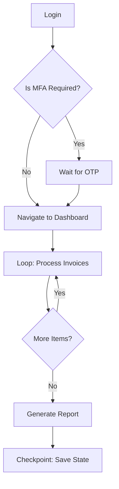

# Universal Recipe Schema v2.0 - Architecture Specification

> **Classification**: Industrial-Grade | Fortune 500 Ready
> **Philosophy**: _"Assume the internet is broken and hostile. Design for failure."_

---

## Table of Contents

1. [Schema Overview](#schema-overview)
2. [Core JSON Schema](#core-json-schema)
3. [Comprehensive Example](#comprehensive-example)
4. [Logic Rules for Planner AI](#logic-rules-for-planner-ai)
5. [Edge Case Handling](#edge-case-handling)
6. [Verification Plan](#verification-plan)

---

## Schema Overview

### Architecture: Directed Acyclic Graph (DAG)



### Key Concepts

| Concept        | Description                                        |
| -------------- | -------------------------------------------------- |
| **Node**       | Atomic unit of work (click, type, extract, decide) |
| **Edge**       | Dependency relationship between nodes              |
| **Checkpoint** | State snapshot for hydration/resume                |
| **Guard**      | Pre/post conditions with fallback actions          |
| **Context**    | Shared variable store across nodes                 |

---

## Core JSON Schema

### Root Structure

```json
{
  "$schema": "https://e2e-platform.io/schemas/recipe/v2.0",
  "version": "2.0.0",

  "metadata": {
    "id": "uuid-v4-here",
    "name": "invoice_processor_v3",
    "description": "Process invoices from SAP with retry and human approval",
    "author": "automation-team",
    "created_at": "2025-12-25T10:00:00Z",
    "updated_at": "2025-12-25T10:00:00Z",
    "tags": ["finance", "sap", "invoices"],
    "priority": "high",
    "estimated_duration_ms": 300000,
    "max_cost_usd": 5.0
  },

  "config": {
    "resource_tier": "standard|high_memory|gpu",
    "browser": "chromium|firefox|webkit",
    "viewport": { "width": 1920, "height": 1080 },
    "locale": "en-US",
    "timezone": "America/New_York",
    "geolocation": { "latitude": 40.7128, "longitude": -74.006 },
    "proxy": {
      "enabled": true,
      "type": "residential|datacenter",
      "region": "us|eu|asia",
      "sticky_session": true
    },
    "stealth_mode": true,
    "record_video": true,
    "screenshot_on_error": true
  },

  "inputs": {
    "required": [
      { "name": "username", "type": "string", "encrypted": true },
      { "name": "password", "type": "string", "encrypted": true },
      { "name": "invoice_csv_url", "type": "url" }
    ],
    "optional": [
      { "name": "batch_size", "type": "integer", "default": 50 },
      { "name": "dry_run", "type": "boolean", "default": false }
    ]
  },

  "context": {
    "description": "Shared state across all nodes",
    "initial": {
      "processed_count": 0,
      "failed_ids": [],
      "current_page": 1
    }
  },

  "nodes": ["...see Node Schema below..."],

  "edges": ["...see Edge Schema below..."],

  "entry_point": "node_login",

  "exit_points": {
    "success": "node_generate_report",
    "failure": "node_error_handler",
    "timeout": "node_timeout_handler"
  },

  "global_guards": {
    "modal_detector": {
      "enabled": true,
      "selectors": ["[role='dialog']", ".modal-overlay", "[aria-modal='true']"],
      "action": "dismiss_or_escalate"
    },
    "session_validator": {
      "check_interval_ms": 30000,
      "indicator": "element_visible",
      "selector": "#user-avatar",
      "on_failure": "goto:node_login"
    }
  }
}
```

---

### Node Schema (Atomic Work Unit)

```json
{
  "id": "node_login",
  "type": "action|decision|loop|checkpoint|human_gate|parallel",
  "name": "User Login",
  "description": "Authenticate user with credentials",

  "execution": {
    "timeout_ms": 30000,
    "retry": {
      "max_attempts": 3,
      "backoff_strategy": "exponential",
      "initial_delay_ms": 1000,
      "max_delay_ms": 10000,
      "retry_on": ["timeout", "element_not_found", "network_error"]
    },
    "resource_tier": "standard",
    "isolation": "shared|dedicated"
  },

  "pre_conditions": [
    {
      "id": "pc_page_loaded",
      "check": "page_url_matches",
      "pattern": "https://app.example.com/login*",
      "on_failure": {
        "action": "navigate",
        "target": "https://app.example.com/login"
      }
    },
    {
      "id": "pc_not_logged_in",
      "check": "element_not_visible",
      "selector": "#user-dashboard",
      "on_failure": {
        "action": "skip_to",
        "target": "node_dashboard"
      }
    }
  ],

  "actions": [
    {
      "seq": 1,
      "type": "find_and_type",
      "intent": "username input field",
      "value": "{{ inputs.username }}",
      "clear_first": true
    },
    {
      "seq": 2,
      "type": "find_and_type",
      "intent": "password input field",
      "value": "{{ inputs.password }}",
      "mask_in_logs": true
    },
    {
      "seq": 3,
      "type": "find_and_click",
      "intent": "login button or sign in button"
    },
    {
      "seq": 4,
      "type": "wait_for_navigation",
      "timeout_ms": 10000
    }
  ],

  "post_conditions": [
    {
      "id": "poc_login_success",
      "check": "any_of",
      "conditions": [
        { "check": "url_contains", "value": "/dashboard" },
        { "check": "element_visible", "selector": "#user-avatar" }
      ],
      "on_failure": {
        "action": "branch",
        "conditions": [
          {
            "if": { "check": "element_visible", "selector": ".mfa-prompt" },
            "then": { "action": "goto", "target": "node_mfa_handler" }
          },
          {
            "if": { "check": "element_visible", "selector": ".error-message" },
            "then": {
              "action": "fail",
              "reason": "Invalid credentials",
              "extract_error": ".error-message"
            }
          }
        ],
        "default": {
          "action": "retry",
          "reason": "Unknown login failure"
        }
      }
    }
  ],

  "state_policy": {
    "checkpoint": true,
    "save": ["cookies", "local_storage", "session_storage", "url"],
    "checkpoint_id": "post_login_{{ timestamp }}"
  },

  "telemetry": {
    "emit_events": ["node_started", "action_completed", "node_finished"],
    "custom_metrics": {
      "login_duration_ms": "{{ node.duration }}"
    }
  }
}
```

---

### Specialized Node Types

#### Decision Node (Branching)

```json
{
  "id": "node_check_invoice_type",
  "type": "decision",
  "name": "Route by Invoice Type",

  "evaluate": {
    "source": "{{ context.current_invoice.type }}",
    "branches": [
      {
        "condition": "equals",
        "value": "CREDIT_MEMO",
        "target": "node_process_credit"
      },
      {
        "condition": "equals",
        "value": "DEBIT_MEMO",
        "target": "node_process_debit"
      },
      {
        "condition": "greater_than",
        "field": "{{ context.current_invoice.amount }}",
        "value": 10000,
        "target": "node_require_approval"
      }
    ],
    "default": "node_process_standard"
  }
}
```

#### Loop Node (Iteration)

```json
{
  "id": "node_process_invoices",
  "type": "loop",
  "name": "Process All Invoices",

  "loop": {
    "source": "{{ context.invoices }}",
    "iterator_var": "current_invoice",
    "index_var": "invoice_index",
    "max_iterations": 5000,
    "batch_size": 50,
    "parallel": false,
    "continue_on_error": true,
    "checkpoint_every": 10,
    "body": "node_process_single_invoice",
    "on_item_error": {
      "action": "log_and_continue",
      "store_in": "context.failed_ids"
    },
    "on_complete": "node_generate_report"
  }
}
```

#### Human Gate Node (Human-in-the-Loop)

```json
{
  "id": "node_require_approval",
  "type": "human_gate",
  "name": "Manager Approval Required",

  "gate": {
    "reason": "Invoice amount exceeds $10,000 threshold",
    "prompt": "Approve invoice #{{ context.current_invoice.id }} for ${{ context.current_invoice.amount }}?",
    "options": [
      { "id": "approve", "label": "Approve", "next": "node_process_approved" },
      { "id": "reject", "label": "Reject", "next": "node_mark_rejected" },
      { "id": "escalate", "label": "Escalate to VP", "next": "node_escalate" }
    ],
    "timeout": {
      "duration_hours": 24,
      "on_timeout": "node_auto_reject"
    },
    "notification": {
      "channels": ["email", "slack"],
      "recipients": ["{{ context.manager_email }}", "#approvals-channel"]
    }
  },

  "state_policy": {
    "checkpoint": true,
    "hibernate": true,
    "save": ["cookies", "local_storage", "url", "context"]
  }
}
```

#### Checkpoint Node (State Snapshot)

```json
{
  "id": "node_save_progress",
  "type": "checkpoint",
  "name": "Save Progress at 50%",

  "checkpoint": {
    "id": "progress_{{ context.processed_count }}",
    "storage": "persistent",
    "ttl_hours": 168,
    "save": {
      "browser_state": ["cookies", "local_storage", "session_storage"],
      "page_state": ["url", "scroll_position"],
      "context": true,
      "screenshot": true
    },
    "compression": "gzip",
    "encryption": true
  }
}
```

#### Parallel Node (Concurrent Execution)

```json
{
  "id": "node_parallel_extract",
  "type": "parallel",
  "name": "Extract Data from Multiple Tabs",

  "parallel": {
    "max_concurrency": 3,
    "branches": [
      { "id": "branch_a", "node": "node_extract_summary" },
      { "id": "branch_b", "node": "node_extract_line_items" },
      { "id": "branch_c", "node": "node_extract_attachments" }
    ],
    "join_strategy": "wait_all|wait_any|wait_n",
    "wait_n_count": 2,
    "on_partial_failure": "continue_with_available",
    "merge_results": {
      "strategy": "deep_merge",
      "target": "context.extracted_data"
    }
  }
}
```

---

### Edge Schema (Dependencies)

```json
{
  "edges": [
    {
      "id": "edge_login_to_dashboard",
      "from": "node_login",
      "to": "node_dashboard",
      "condition": null
    },
    {
      "id": "edge_mfa_branch",
      "from": "node_login",
      "to": "node_mfa_handler",
      "condition": {
        "type": "post_condition_failed",
        "post_condition_id": "poc_login_success",
        "failure_reason": "mfa_required"
      }
    },
    {
      "id": "edge_loop_body",
      "from": "node_process_invoices",
      "to": "node_process_single_invoice",
      "type": "loop_body"
    },
    {
      "id": "edge_loop_continue",
      "from": "node_process_single_invoice",
      "to": "node_process_invoices",
      "type": "loop_continue"
    }
  ]
}
```

---

### Variable Syntax Reference

| Syntax            | Description            | Example                                |
| ----------------- | ---------------------- | -------------------------------------- |
| `{{ inputs.* }}`  | User-provided inputs   | `{{ inputs.username }}`                |
| `{{ context.* }}` | Shared workflow state  | `{{ context.processed_count }}`        |
| `{{ secrets.* }}` | Encrypted vault values | `{{ secrets.api_key }}`                |
| `{{ env.* }}`     | Environment variables  | `{{ env.PROXY_URL }}`                  |
| `{{ node.* }}`    | Current node metadata  | `{{ node.id }}`, `{{ node.duration }}` |
| `{{ loop.* }}`    | Loop iteration data    | `{{ loop.index }}`, `{{ loop.item }}`  |
| `{{ extract.* }}` | Last extraction result | `{{ extract.0.text }}`                 |
| `{{ timestamp }}` | ISO timestamp          | `2025-12-25T10:00:00Z`                 |
| `{{ uuid }}`      | Generated UUID         | `a1b2c3d4-...`                         |

**Expressions:**

```json
{
  "value": "{{ context.total + 100 }}",
  "condition": "{{ context.items | length > 0 }}",
  "formatted": "{{ context.amount | currency('USD') }}"
}
```

---

## Comprehensive Example

### Workflow: SAP Invoice Processor

```json
{
  "$schema": "https://e2e-platform.io/schemas/recipe/v2.0",
  "version": "2.0.0",

  "metadata": {
    "id": "550e8400-e29b-41d4-a716-446655440000",
    "name": "sap_invoice_processor",
    "description": "Login to SAP, download CSV, process 5000 invoices with approval workflow",
    "author": "enterprise-automation",
    "tags": ["sap", "invoices", "finance", "approval-required"],
    "priority": "critical",
    "estimated_duration_ms": 1800000,
    "max_cost_usd": 25.0
  },

  "config": {
    "resource_tier": "high_memory",
    "browser": "chromium",
    "viewport": { "width": 1920, "height": 1080 },
    "stealth_mode": true,
    "proxy": {
      "enabled": true,
      "type": "residential",
      "region": "us",
      "sticky_session": true
    }
  },

  "inputs": {
    "required": [
      { "name": "sap_username", "type": "string", "encrypted": true },
      { "name": "sap_password", "type": "string", "encrypted": true },
      { "name": "company_code", "type": "string" }
    ],
    "optional": [
      { "name": "invoice_limit", "type": "integer", "default": 5000 },
      { "name": "approval_threshold_usd", "type": "number", "default": 10000 }
    ]
  },

  "context": {
    "initial": {
      "invoices": [],
      "processed_count": 0,
      "approved_count": 0,
      "rejected_count": 0,
      "failed_ids": [],
      "total_amount_processed": 0
    }
  },

  "nodes": [
    {
      "id": "node_init",
      "type": "action",
      "name": "Initialize Browser",
      "actions": [
        {
          "seq": 1,
          "type": "navigate",
          "url": "https://sap.example.com/fiori"
        },
        { "seq": 2, "type": "wait_for_load_state", "state": "networkidle" }
      ],
      "execution": { "timeout_ms": 30000 },
      "post_conditions": [
        { "check": "page_loaded", "on_failure": { "action": "retry" } }
      ]
    },

    {
      "id": "node_login",
      "type": "action",
      "name": "SAP Login",
      "pre_conditions": [
        {
          "check": "element_visible",
          "selector": "#USERNAME_FIELD",
          "on_failure": { "action": "wait", "duration_ms": 2000 }
        }
      ],
      "actions": [
        {
          "seq": 1,
          "type": "find_and_type",
          "intent": "username field",
          "value": "{{ inputs.sap_username }}"
        },
        {
          "seq": 2,
          "type": "find_and_type",
          "intent": "password field",
          "value": "{{ inputs.sap_password }}",
          "mask_in_logs": true
        },
        { "seq": 3, "type": "find_and_click", "intent": "log on button" },
        { "seq": 4, "type": "wait_for_navigation", "timeout_ms": 15000 }
      ],
      "post_conditions": [
        {
          "check": "element_visible",
          "selector": ".sapMShellHeader",
          "on_failure": {
            "action": "branch",
            "conditions": [
              {
                "if": {
                  "check": "element_visible",
                  "selector": ".sapMMsgBoxError"
                },
                "then": { "action": "fail", "reason": "Login failed" }
              }
            ]
          }
        }
      ],
      "state_policy": {
        "checkpoint": true,
        "save": ["cookies", "local_storage"]
      },
      "execution": { "timeout_ms": 45000, "retry": { "max_attempts": 2 } }
    },

    {
      "id": "node_navigate_invoices",
      "type": "action",
      "name": "Navigate to Invoice Workbench",
      "actions": [
        {
          "seq": 1,
          "type": "find_and_click",
          "intent": "invoice management tile or invoices menu"
        },
        {
          "seq": 2,
          "type": "wait_for_selector",
          "selector": ".invoice-table",
          "timeout_ms": 10000
        }
      ],
      "execution": { "timeout_ms": 30000 },
      "post_conditions": [
        {
          "check": "element_visible",
          "selector": ".invoice-table",
          "on_failure": { "action": "retry" }
        }
      ]
    },

    {
      "id": "node_apply_filters",
      "type": "action",
      "name": "Apply Company Code Filter",
      "actions": [
        {
          "seq": 1,
          "type": "find_and_click",
          "intent": "filter button or filter icon"
        },
        {
          "seq": 2,
          "type": "find_and_type",
          "intent": "company code filter",
          "value": "{{ inputs.company_code }}"
        },
        {
          "seq": 3,
          "type": "find_and_click",
          "intent": "apply filter or go button"
        },
        { "seq": 4, "type": "wait_for_network_idle" }
      ],
      "execution": { "timeout_ms": 30000 },
      "post_conditions": [
        {
          "check": "network_idle",
          "on_failure": { "action": "wait", "duration_ms": 3000 }
        }
      ]
    },

    {
      "id": "node_extract_invoices",
      "type": "action",
      "name": "Extract Invoice List",
      "actions": [
        {
          "seq": 1,
          "type": "extract_table",
          "selector": ".invoice-table",
          "columns": [
            "invoice_id",
            "vendor",
            "amount",
            "currency",
            "due_date",
            "status"
          ],
          "max_rows": "{{ inputs.invoice_limit }}",
          "store_in": "context.invoices"
        }
      ],
      "execution": { "timeout_ms": 60000 },
      "post_conditions": [
        {
          "check": "context_value",
          "path": "context.invoices",
          "condition": "length_greater_than",
          "value": 0,
          "on_failure": { "action": "goto", "target": "node_no_invoices" }
        }
      ]
    },

    {
      "id": "node_process_loop",
      "type": "loop",
      "name": "Process Each Invoice",
      "loop": {
        "source": "{{ context.invoices }}",
        "iterator_var": "current_invoice",
        "index_var": "idx",
        "max_iterations": 5000,
        "batch_size": 50,
        "checkpoint_every": 25,
        "continue_on_error": true,
        "body": "node_process_single",
        "on_item_error": {
          "action": "log_and_continue",
          "store_in": "context.failed_ids"
        },
        "on_complete": "node_generate_report"
      },
      "execution": { "timeout_ms": 3600000 }
    },

    {
      "id": "node_process_single",
      "type": "action",
      "name": "Process Single Invoice",
      "actions": [
        {
          "seq": 1,
          "type": "find_and_click",
          "intent": "invoice row {{ loop.item.invoice_id }}"
        },
        {
          "seq": 2,
          "type": "wait_for_selector",
          "selector": ".invoice-detail-panel"
        },
        {
          "seq": 3,
          "type": "extract_text",
          "selector": ".invoice-total",
          "store_in": "context.current_amount"
        },
        {
          "seq": 4,
          "type": "set_context",
          "path": "context.processed_count",
          "value": "{{ context.processed_count + 1 }}"
        }
      ],
      "execution": { "timeout_ms": 30000 },
      "post_conditions": [
        {
          "check": "expression",
          "value": "{{ context.current_amount > inputs.approval_threshold_usd }}",
          "on_success": { "action": "goto", "target": "node_human_approval" }
        }
      ]
    },

    {
      "id": "node_human_approval",
      "type": "human_gate",
      "name": "High-Value Invoice Approval",
      "gate": {
        "reason": "Invoice #{{ loop.item.invoice_id }} exceeds ${{ inputs.approval_threshold_usd }}",
        "prompt": "Approve payment of ${{ context.current_amount }} to {{ loop.item.vendor }}?",
        "options": [
          {
            "id": "approve",
            "label": "Approve",
            "next": "node_approve_action"
          },
          { "id": "reject", "label": "Reject", "next": "node_reject_action" }
        ],
        "timeout": { "duration_hours": 48, "on_timeout": "node_escalate" },
        "notification": {
          "channels": ["email"],
          "recipients": ["finance-approvers@company.com"]
        }
      },
      "state_policy": { "checkpoint": true, "hibernate": true },
      "execution": { "timeout_ms": 172800000 }
    },

    {
      "id": "node_approve_action",
      "type": "action",
      "name": "Approve Invoice in SAP",
      "actions": [
        { "seq": 1, "type": "find_and_click", "intent": "approve button" },
        { "seq": 2, "type": "wait_for_network_idle" },
        {
          "seq": 3,
          "type": "set_context",
          "path": "context.approved_count",
          "value": "{{ context.approved_count + 1 }}"
        }
      ],
      "execution": { "timeout_ms": 30000 },
      "post_conditions": [
        {
          "check": "element_visible",
          "selector": ".success-message",
          "on_failure": { "action": "retry" }
        }
      ]
    },

    {
      "id": "node_generate_report",
      "type": "action",
      "name": "Generate Summary Report",
      "actions": [
        {
          "seq": 1,
          "type": "create_report",
          "format": "json",
          "content": {
            "total_processed": "{{ context.processed_count }}",
            "approved": "{{ context.approved_count }}",
            "rejected": "{{ context.rejected_count }}",
            "failed": "{{ context.failed_ids | length }}",
            "failed_ids": "{{ context.failed_ids }}",
            "total_amount": "{{ context.total_amount_processed }}"
          },
          "store_in": "context.final_report"
        }
      ],
      "execution": { "timeout_ms": 30000 },
      "state_policy": { "checkpoint": true }
    },

    {
      "id": "node_no_invoices",
      "type": "action",
      "name": "No Invoices Found",
      "actions": [
        {
          "seq": 1,
          "type": "log",
          "message": "No invoices found for company code {{ inputs.company_code }}"
        }
      ],
      "execution": { "timeout_ms": 5000 }
    },

    {
      "id": "node_error_handler",
      "type": "action",
      "name": "Global Error Handler",
      "actions": [
        {
          "seq": 1,
          "type": "screenshot",
          "store_in": "context.error_screenshot"
        },
        {
          "seq": 2,
          "type": "extract_text",
          "selector": ".error-message, [role='alert']",
          "store_in": "context.error_text"
        },
        {
          "seq": 3,
          "type": "emit_event",
          "event": "workflow_error",
          "data": "{{ context }}"
        }
      ],
      "execution": { "timeout_ms": 30000 }
    }
  ],

  "edges": [
    { "from": "node_init", "to": "node_login" },
    { "from": "node_login", "to": "node_navigate_invoices" },
    { "from": "node_navigate_invoices", "to": "node_apply_filters" },
    { "from": "node_apply_filters", "to": "node_extract_invoices" },
    { "from": "node_extract_invoices", "to": "node_process_loop" },
    {
      "from": "node_approve_action",
      "to": "node_process_loop",
      "type": "loop_continue"
    },
    { "from": "node_no_invoices", "to": "node_generate_report" }
  ],

  "entry_point": "node_init",

  "exit_points": {
    "success": "node_generate_report",
    "failure": "node_error_handler",
    "timeout": "node_error_handler"
  },

  "global_guards": {
    "session_validator": {
      "check_interval_ms": 60000,
      "selector": ".sapMShellHeader",
      "on_failure": "goto:node_login"
    },
    "modal_detector": {
      "enabled": true,
      "selectors": ["[role='dialog']", ".sapMDialog", "[aria-modal='true']"],
      "action": "dismiss_or_escalate"
    }
  }
}
```

---

## Logic Rules for Planner AI

### 15 Strict Rules (Non-Negotiable)

| #   | Rule                              | Enforcement                                                            |
| --- | --------------------------------- | ---------------------------------------------------------------------- |
| 1   | **Loop Limits**                   | Every loop MUST have `max_iterations` (default: 1000, max: 10000)      |
| 2   | **Timeout Mandatory**             | Every node MUST have `timeout_ms` (default: 30000ms, max: 300000ms)    |
| 3   | **Post-Condition Required**       | Every action node MUST have at least one `post_condition`              |
| 4   | **Checkpoint After Login**        | Any authentication node MUST set `state_policy.checkpoint: true`       |
| 5   | **No Orphan Nodes**               | Every node (except entry_point) MUST have at least one incoming edge   |
| 6   | **Exit Coverage**                 | Recipe MUST define all three `exit_points`: success, failure, timeout  |
| 7   | **Secret Masking**                | Actions with passwords/tokens MUST set `mask_in_logs: true`            |
| 8   | **Retry Limits**                  | `retry.max_attempts` MUST NOT exceed 5                                 |
| 9   | **Human Gate Timeout**            | Every `human_gate` MUST have a timeout with `on_timeout` action        |
| 10  | **Loop Checkpointing**            | Loops with 100+ iterations MUST set `checkpoint_every: N` where N ≤ 50 |
| 11  | **Error Storage**                 | Loops MUST define `on_item_error` with storage location                |
| 12  | **Parallel Limits**               | `parallel.max_concurrency` MUST NOT exceed 5                           |
| 13  | **Variable Validation**           | Verify `{{ context.X }}` is defined before use                         |
| 14  | **No Circular Dependencies**      | Edges MUST NOT create cycles (except loop_continue)                    |
| 15  | **No Self-Referential Fallbacks** | `on_failure` MUST NOT point to the same node                           |

---

## Edge Case Handling

### 1. Infinite Loops Prevention

```json
{
  "loop": {
    "max_iterations": 5000,
    "convergence_detection": {
      "enabled": true,
      "hash_fields": ["context.processed_ids"],
      "stall_threshold": 5
    }
  }
}
```

### 2. Network Loss Recovery

```json
{
  "execution": {
    "retry": {
      "retry_on": ["network_error", "timeout", "connection_reset"],
      "backoff_strategy": "exponential",
      "max_delay_ms": 60000
    }
  }
}
```

### 3. Unknown Popups/Modals

```json
{
  "global_guards": {
    "modal_detector": {
      "enabled": true,
      "selectors": [
        "[role='dialog']",
        "[aria-modal='true']",
        ".modal-backdrop"
      ],
      "dismiss_strategies": [
        {
          "type": "click",
          "selectors": ["[aria-label='Close']", ".close-btn"]
        },
        { "type": "keyboard", "key": "Escape" }
      ],
      "on_dismiss_failure": {
        "action": "escalate",
        "capture_screenshot": true
      }
    }
  }
}
```

### 4. CAPTCHA Handling

```json
{
  "global_guards": {
    "captcha_detector": {
      "enabled": true,
      "selectors": ["iframe[src*='recaptcha']", "iframe[src*='hcaptcha']"],
      "on_detection": {
        "action": "human_gate",
        "prompt": "CAPTCHA detected. Please solve manually.",
        "checkpoint_before": true
      }
    }
  }
}
```

---

## Verification Plan

### Automated Validation

```bash
# Run schema validation
python scripts/recipeValidator.py recipe.json

# Expected output:
# ✅ All 15 rules passed
# VALIDATION PASSED: Recipe is production-ready
```

### Manual Testing Checklist

1. **Hydration Test**: Stop at Step 10, restart from checkpoint
2. **Network Kill Test**: Disable network mid-workflow
3. **Modal Injection Test**: Inject random modal
4. **Timeout Test**: Set `timeout_ms: 1`
5. **Loop Stress Test**: Process 5000 items

---

> **Version**: 2.0.0
> **Updated**: 2025-12-25
